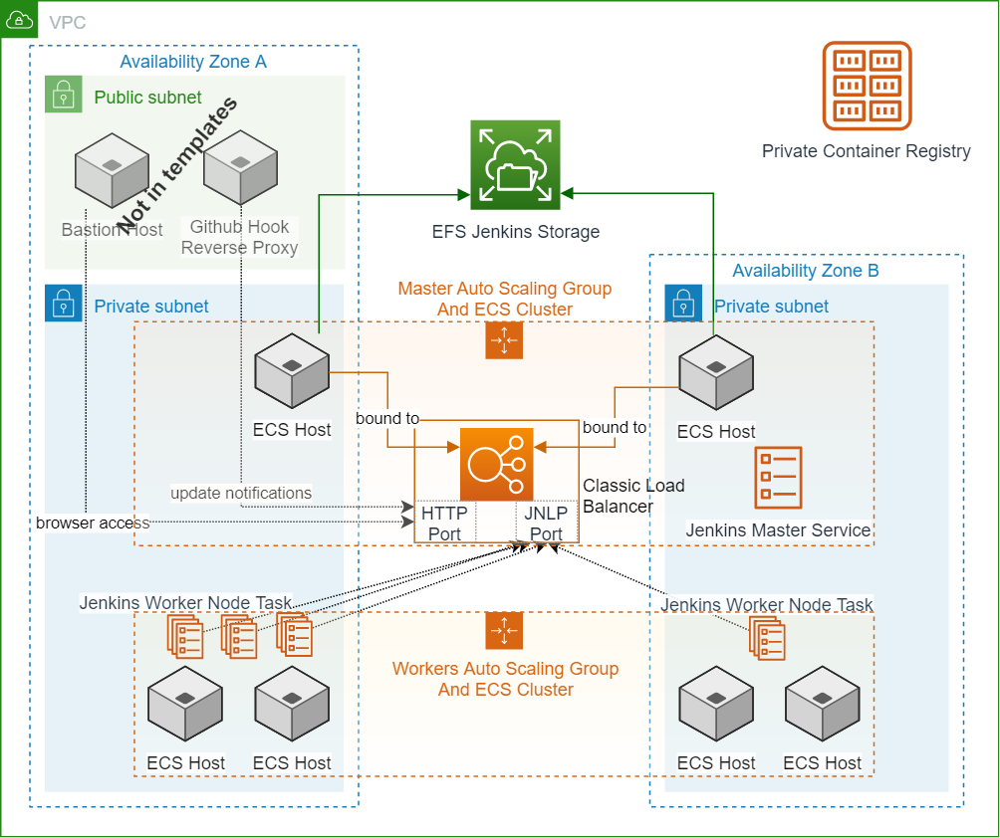

# Amazon ECS, AWS CloudFormation, and an Application Load Balancer for Jenkins

This reference architecture provides a set of YAML templates for deploying microservices to [Amazon EC2 Container Service (Amazon ECS)](http://docs.aws.amazon.com/AmazonECS/latest/developerguide/Welcome.html) with [AWS CloudFormation](https://aws.amazon.com/cloudformation/).

See the post [Running Jenkins on ECS](http://www.devgrok.com/2019/06/jenkins-ecs.html) for details of this stack.

## Overview

